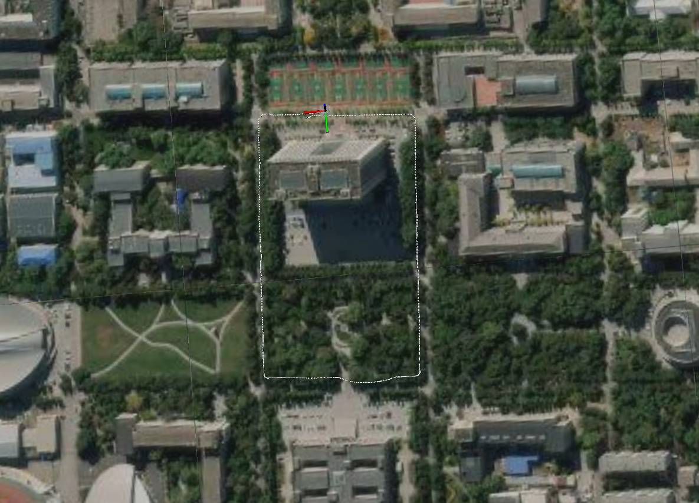
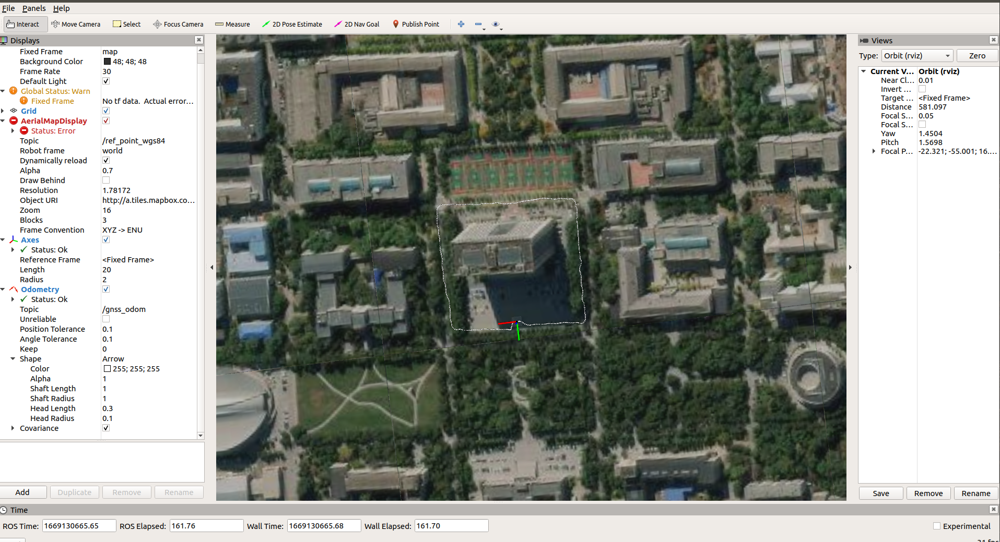

# multisensor_fusion_localization_study
This repo is just  a record for my study for multisensor_fusion_localization and  is released by tag form.    
Currently,expect to  achieve   a robust and long term localization system with map-updating coupled gnss-lidar-inertial
fusion.      
  
**Relate Video:** [bilibili](https://space.bilibili.com/356146260/channel/collectiondetail?sid=753064&ctype=0)  

**Relate paper:**  
[GVINS: Tightly Coupled GNSS-Visual-Inertial Fusion for Smooth and Consistent State Estimation](https://arxiv.org/abs/2103.07899)     
[IC-GVINS: A Robust, Real-time, INS-Centric GNSS-Visual-Inertial Navigation System for Wheeled Robot](https://arxiv.org/abs/2204.04962)      
[LIO-SAM: Tightly-coupled Lidar Inertial Odometry via Smoothing and Mapping](https://arxiv.org/abs/2007.00258)  

**Contacts:** For any technical issues, please open an issue at this repository or sent an email to me niu_wengang@163.com.

**Pipeline:**

**Example:**    
<left class="half">
    
    
</left>
     
## 1.Dependency
**ros melodic**
```shell
#just follow ros wiki for melodic version
```
**cmake  (3.16 or higher is required)**  
```
#You don't need to remove the old version, just press the instructions below
git clone -b v3.16.5  https://github.com/Kitware/CMake.git
mkdir build && cd build
cmake ..
make 
sudo make install 
```
**GeographicLib**
```shell
git clone https://github.com/geographiclib/geographiclib.git  
mkdir build && cd build  
cmake ..  
make   
sudo make install   
#you can check cmake version by pressing  the instructions below
cmake --version  
```
**glog**
```shell
git clone https://github.com/google/glog.git 
mkdir build && cd build  
cmake ..  
make   
sudo make install   
```
**yaml-cpp (0.6 or higher is required)**
```
git clone -b yaml-cpp-0.6.0 https://github.com/jbeder/yaml-cpp.git  
cmake ..  
make   
sudo make install   
```  
**ros_qt5**
```shell
sudo apt-get install ros-melodic-qt-create    
sudo apt-get install ros-melodic-qt-build  
```
gtsam  
```

```
## 2.Device and config  
**GNSS:** Ublox zedf9p      
**IMU:** FDISYSTEM N100       
**Lidar:** Velodyne 16     
**Camera:** ZED2i (Optional)


<left class="half">
    
</left>


## 3.Build 
```
cd $multisensor_fusion_localization_study
catkin_make 
```
## 4.Config Param
before run on public dataset or with your device, param must be seted.


## 5.Run
```
chmod +x glins.sh
./quick_start
```

## 6.Acknowledgements    
Thanks to GTSAM.

## 7.Licence  
The source code is released under GPLv3 license.

## 8.Update Log   
**Level 0:  Mainly study the code  framework use  public dataset**  
2022/09/16 Tag v1.0  Combaine and display  imu and gnss data by rviz_satellite.    
2022/10/02 Tag v2.0  Use ndt  algorithm to calculatelidar odom.  
2022/11/07 Tag v3.0  Loosly couple  lidar  odom with gnss.  
2022/11/14 Tag v4.0  Simple use ndt algorithm to realize localization.  
**Level 1:Refinement my repo code use real device**  
To publish  Tag v5.0    
**Level 2:Create something new**  


