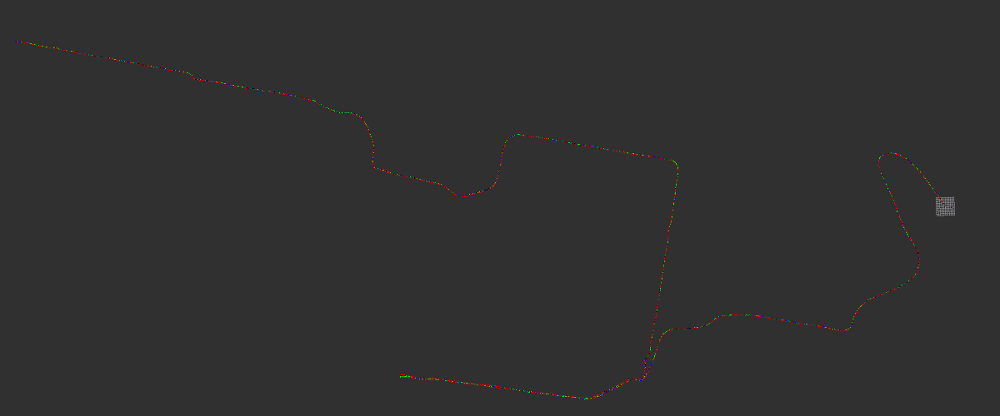

# LightRoadMap

AlkaidQuadrotor is  an intelligent robot  included hardware and software for personal assistant. It will carries multi sensors (gnss、lidar、imu、camera)  and computing equipments (Intel nuc、Pix)  to achieve localization、planning、decision、perception. 

Actually, the project is  a vision for accomplishing a whole robot system  entirely independently

If having advice or issue, please contact me at email  niu_wengang@163.com .   


## 1. Algorithm Workflow

<div align=center></div>

### 1.1 Localization Part

LIO<sup>[1]</sup><sup>[2]</sup>

### 1.2 Planning Part
hybrid+minimum snap <sup>[3]</sup>

### 1.3 Perception Part

cnn


### 1.4 Decision Part
decision tree

## 2.Hardware Config

|              device              | amount | price |
| :------: | :--: | :----: |
|    QV250 rack and attachment    |  1   | 100 |
| EMAX Bullet 30A |  4   | 510 |
|     R12DSM receiver     |  1   | 90 |
|  livox mid360  |  1   | 5000 |
| realsense d435i | 1 | 2700 |
| RadioLink AT9S Pro | 1 | 600 |
| Holybro Pixhawk 6CMini | 1 | 1200 |
| buzzer | 1 | 10 |
| tattu li-ion battery  4s 2300mah | 1 | 140 |
| IMAX B6AC 80W | 1 | 120 |
| DCDC | 2 | 30 |
| TMOTOR V2306-2400KV | 5 | 350 |
| tools and consumable items | — | 400 |
| total |  | 11250 |

<div align=center></div>


## 3.Env Config
ubuntu20.04

cmake/thirdparty_libs.cmake

|  opensource  |  function  |    version    |installation method|check version|
| :----: | :----: | :----: | :----: | :----: |
| cmake | build tool | 3.13.0 |source code|```cmake --version```|
| eigen | matrix calculation | 3.3.4 |```sudo apt-get install libeigen3-dev```|```pkg-config --modversion eigen3```|
| pcl | point cloud handle | --- | ```sudo apt-get install ros-melodic-pcl-ros``` |  |
| opencv |     image handle     |3.2.0| ```sudo apt-get install libopencv-dev``` | ```pkg-config opencv --modversion``` |
|  gtest   |      unit test      | --- |    ```sudo apt-get install libgtest-dev```     |                                      |
| yaml-cpp |      yaml read and write      | 0.7.0 |    source code    |                                      |
| geographiclib | gnss handle | master | source code |                                      |
|  sophus  |   matrix calculation on manifold   |----| source code | |
| tbb | intel thread building blocks |TBB 2020.2| source code | |
|  |  ||  | |


## 4.Start
### 4.1 Dataset

+ NCLT

+ Urban Nav

+ Data collected by device (without ground truth)

  

### 4.2 Compile

### 4.3 Run

## 5. Experimentation

<div align=center></div>


## 6.Update Log

|date| branch | update  description | commit_id | video |
| :----: | :----:| :----: | ------ | ------ |
| 2022//11/20 | V0.1 | simple framework for mapping and localization  with  gnss、imu and lidar loosely coupled |6885639|[v0.1 demo1](https://www.bilibili.com/video/BV1mt4y1K7Nt/?spm_id_from=333.999.0.0&vd_source=b86740d9f2b244ac781ad5f60dd8e818)     [v0.1 demo2](https://www.bilibili.com/video/BV1Ce4y1s75g/?spm_id_from=333.788&vd_source=b86740d9f2b244ac781ad5f60dd8e818)|
| 2023/08/10 | V0.2 | simple tightly coupled  lio |                                    |                                    |
| 2023/09/10 | V0.3 |      |||


## 7. Standard

+ **C++ standard** c++ 17   

+ **code style** visual studio style

 + **naming conventions**  
    class: MyClass  
    function: MyFunction      
    member variable:   _my_function_ptr _my_function_vec    
    ordinary variable:     my_function_ptr   my_function_vec    
    
    namespace: pipe_ns、module_ns
    
    macro definition: _QUADROTOR_HPP
    
 +  **commit rules**<sup>[4]</sup>

```Bash
<type>[<scope>]:<subject>
```

--type

feat：new feature  
fixed：bugs  has been fixed  
fixing：bugs is fixing
docs：readme.txt
refactor：refactor  framework
perf：optimize the performance
config: modify config file 
test：add test unit 
chore：build tools changed  
revert：reset to history commit
merge：merge branch  

for example:
```
fix[Planning]:fixed the bug of core dumped 
docs[README]:add links of paper
feat[Localization]:add kd treemethod  
```

## 8.Reference

[1]  [MARS:ROG-Map](https://github.com/hku-mars/ROG-Map)  
[2]  [gaoxiang:slam_in_autonomous_driving](https://github.com/gaoxiang12/slam_in_autonomous_driving)  
[3]  [ HUKST Aerial Robotics Group:Fast-Planner](https://github.com/HKUST-Aerial-Robotics/Fast-Planner)  
[4]  [How to submit standard git commit？](https://zhuanlan.zhihu.com/p/182553920)  

## 9.Licence
The source code is released under [GPLv3](http://www.gnu.org/licenses/) license. 
